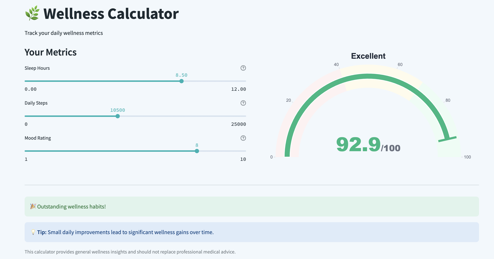

# 🌿 Wellness Score Calculator

Track your daily wellness using a simple and interactive tool. The **Wellness Score Calculator** is a lightweight app that calculates a daily wellness score (0–100) using three metrics: **Sleep Hours**, **Daily Steps**, and **Mood Rating**. It combines rule-based scoring logic with a trained ML model (Random Forest) and displays results in a beautiful interactive dashboard.



---

## 🧠 Project Motivation

Modern life demands simple, quick, and personalized wellness insights. This app aims to:
- Quantify daily wellness in a meaningful, interpretable way
- Encourage small lifestyle improvements through visual feedback
- Demonstrate practical use of hybrid rule-based + ML scoring systems

---

## ⚙️ Scoring Logic

Each input metric contributes to the final score based on predefined weights:

| Metric       | Ideal Range     | Weight  | Logic                                                             |
|--------------|------------------|---------|-------------------------------------------------------------------|
| Sleep Hours  | 7–9 hrs          | 0.35    | Penalized for less than 6 or more than 10 hrs                     |
| Step Count   | >8000 steps      | 0.40    | Scaled linearly up to 25,000 steps                                |
| Mood Rating  | 1–10 scale       | 0.25    | Captures subjective daily emotional state                         |

The final score = weighted average of individual metric scores.  
The ML model was trained on synthetic data generated using this logic, allowing slight non-linear behavior capture.

---

## 💡 Features

- 📈 Interactive Streamlit dashboard
- 🎯 Instant feedback via real-time wellness score (gauge)
- ✅ Slider inputs for:
  - Sleep Hours (0–12 hrs)
  - Daily Steps (0–25,000)
  - Mood Rating (1–10)
- 🌱 Personalized health tips and motivation
- 🔒 All processing is local — no sensitive data collected

---

## 🖥️ Dashboard Preview


---


---

## 🚀 Getting Started

### 1. Clone the Repo

```bash
git clone https://github.com/srishhhhx/Health-Wellness.git
cd Health-Wellness

pip install -r requirements.txt

streamlit run app/app.py

